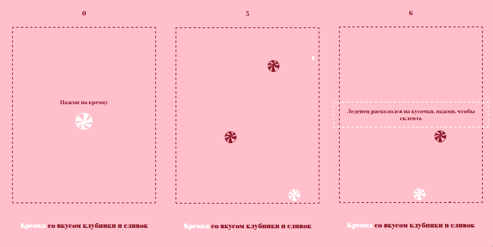

# https://bubenture.github.io/kremka
# Kremka

 

    
    

 

#### The site is an arcade game where the player controls a "lollipop" and defends against falling enemies, featuring support for various devices and a minimalist interface.

##### HTML (index.html):
- The structure of the page, placement of controls, game field (canvas), buttons, and score display.

##### CSS (style.css):
- Styling of the site, text, buttons, background, image animations, and responsiveness for different screens.

##### JavaScript (game.js):
- Game logic: player control, shooting, enemy spawning, collision detection, score counting, handling game over, and restarting.

##### Images (img/ folder):
- Graphics for the player, enemies, and site icon.

##### Font (Salina-Trial-Bold.otf):
- Custom font for text styling.

#### Starting the Game:
- A button "Click on the lollipop" appears on the screen with an image.
- After clicking, the game starts: the player (lollipop) appears at the bottom of the screen, and enemies begin to fall from the top.

#### Controls:
- On PC: left/right arrow keys or mouse (movement), mouse click — shooting.
- On mobile: touch controls (tap — movement and shooting).

#### Gameplay:
- The player can move horizontally and shoot upwards.
- Enemies fall from the top. If an enemy touches the player or reaches the bottom, the game ends.
- Points are awarded for each enemy hit (displayed at the top).

#### Game Over and Restart:
- Upon losing, a button "The lollipop shattered into pieces, click to glue it back together" appears.
- After clicking, the game restarts, and the score resets.

#### Responsiveness:
- The site displays correctly on various devices.
- When resizing the window, the page reloads for proper canvas functionality.

#### Features
- Minimalist design.
- Intuitive controls: support for keyboard, mouse, and touch screens.
- Simple game mechanics: easy to start playing with clear rules.
- No third-party libraries: all logic is implemented in pure JavaScript.
- Reloading on window resize.
